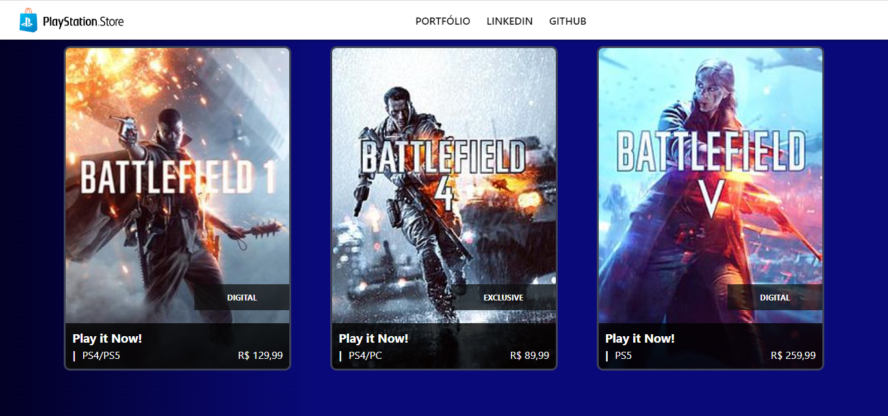

# Psn-Store

Recriando a página da Playstation Store com Angular

## Tópicos abordados durante esse projeto:
* Criação do Projeto com angular CLI
* Construindo a estrutura de um componente
* Pegando os dados dinamicamente
* Pages dinâmicas

## Tecnologias utilizadas no projeto
* Angular
* TypeScript

<h3>Contribuindo</h3>

⭐️ Star o projeto

🐛 Encontrar e relatar issues
